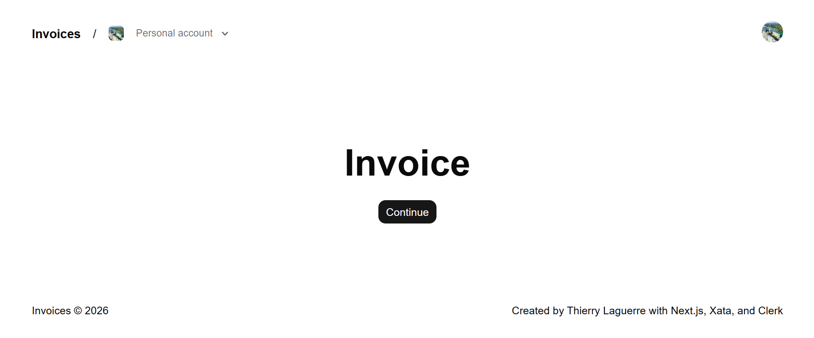
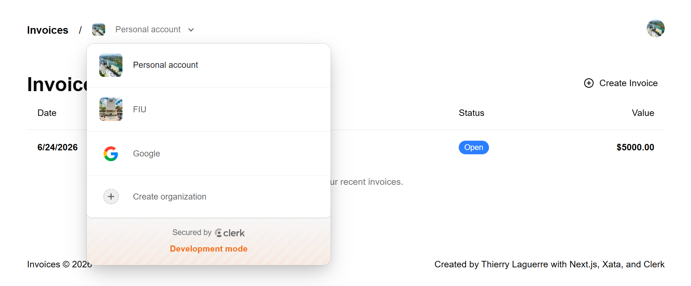
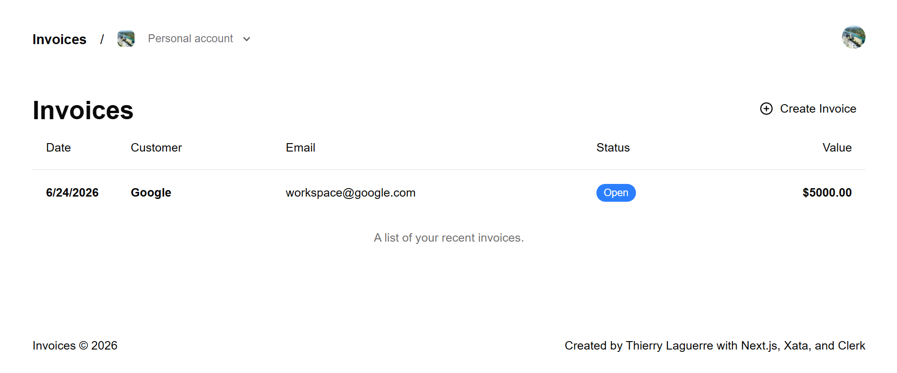
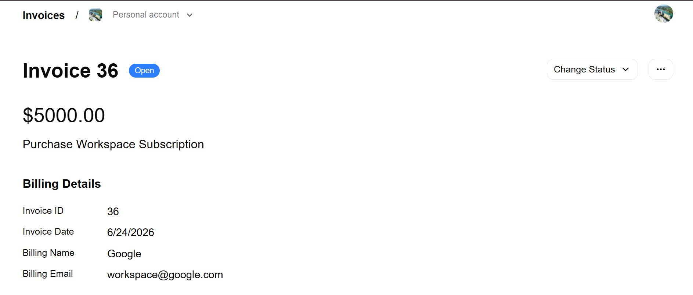
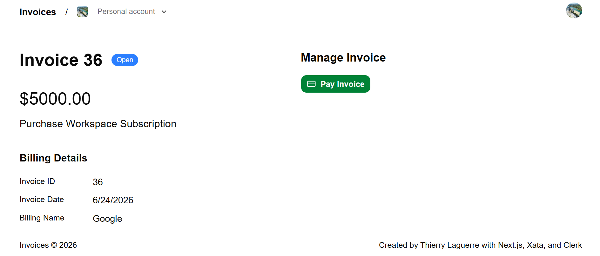
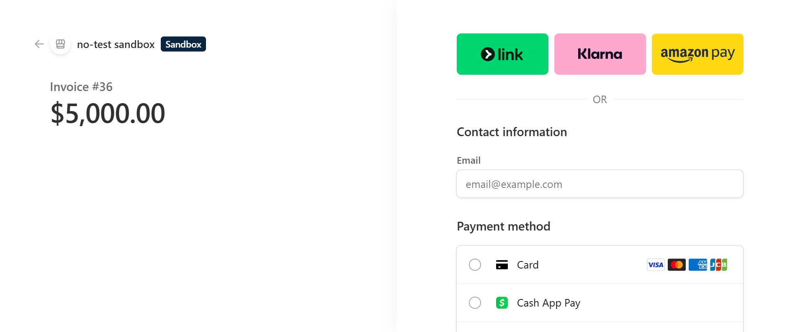
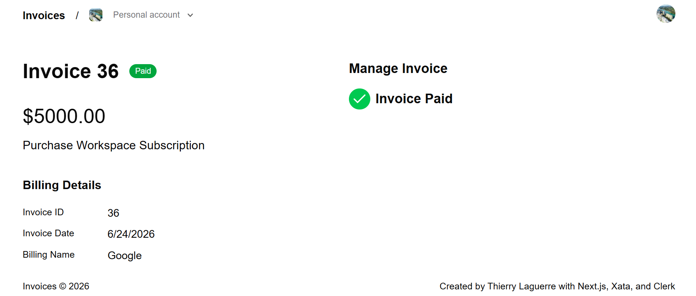
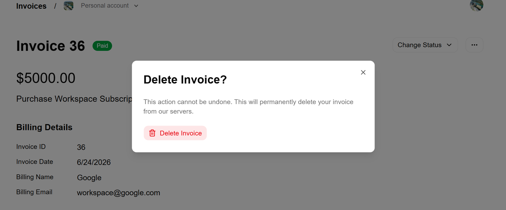

# Invoice App - Next.js 15 Project

This project is a full-stack Invoice Management Application built with Next.js 15. It demonstrates modern web development practices including authentication, database management, transactional emails, and payment processing.

## Key Features

- **Authentication:** Secure user login, signup, and account management powered by Clerk.
- **Database:** Robust data storage using Xata (PostgreSQL) managed with Drizzle ORM.
- **UI/UX:** Built using Tailwind CSS and shadcn/ui components for a clean, responsive design.
- **Payments:** Integrated Stripe for handling payment sessions and checkout flows.
- **Transactional Emails:** Automated email notifications using React Email and Resend.
- **Form Handling:** Utilizes React 19 features and Next.js Server Actions for efficient data submission.

## Tech Stack

- **Framework:** Next.js 15
- **Language:** TypeScript
- **Styling:** Tailwind CSS
- **Components:** shadcn/ui
- **Database/ORM:** Xata, Drizzle ORM
- **Authentication:** Clerk
- **Payments:** Stripe
- **Email:** Resend, React Email

## Getting Started

1. **Initialize Project:** Create a new Next.js 15 application.
2. **Configuration:** Set up your environment variables for Clerk, Xata, Stripe, and Resend in your `.env.local` file.
3. **Database Setup:** Define your schemas in `src/db/schema.ts` and run migrations using Drizzle Kit.
4. **Development:** Run the application locally to test features like invoice creation, status updates, and payment flows.
